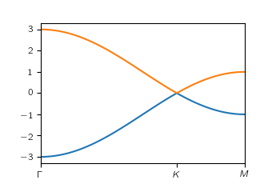

Getting Started
================

The best way to explore the capabilities of ``PythTB`` and to get
started in using it is to read through the :doc:`installation
instructions <install>` and :doc:`PythTB examples <examples>`.

Quick installation
-------------------

Type in terminal::

    pip install pythtb --upgrade

or if you need more assistance follow these :doc:`instructions <install>`.
If you are unfamiliar with Python or are not sure whether Python and the
needed Python modules are installed on your system, see our
:doc:`python introduction <resources>` and :doc:`installation
instructions <install>`.

Quick example
-------------

This is a simple example showing how to define graphene tight-binding
model with first neighbour hopping only. Below is the source code and
plot of the resulting band structure. Here you can find :doc:`more examples <examples>`.

.. raw:: html

    <table style="margin-left: 20px;" align="center" border="0"><tbody><tr>
    <td width="50%">

.. literalinclude:: simple_fig/simple_fig.py

.. raw:: html

    </td>
    <td width="50%">

.. raw:: html

    </td></tr>
    </tbody></table>

Motivations and capabilities
----------------------------

The ``PythTB`` package was written in Python for several reasons,
including

-  The ease of learning and using Python
-  The wide availability of Python in the community
-  The flexibility with which Python can be interfaced with graphics and
   visualization modules
-  In general, the easy extensibility of Python programs

You can get an idea of the capabilities of the package by
browsing the :doc:`PythTB examples <examples>`.

Tight-binding models
^^^^^^^^^^^^^^^^^^^^^

The `tight binding <http://en.wikipedia.org/wiki/Tight_binding>`_
method is an approximate approach for solving for the electronic wave
functions for electrons in solids assuming a basis of localized
atomic-like orbitals. We assume here that the orbitals are
orthonormal, and focus on the “empirical tight binding” approach in
which the Hamiltonian matrix elements are simply parametrized, as
opposed to being computed ab-initio.

The ``PythTB`` package is intended to set up and solve tight-binding
models for the electronic structure of

-  0D clusters
-  1D chains and ladders
-  2D layers (square lattice, hexagonal lattice, honeycomb lattice,
   etc.)
-  3D crystals
-  clusters, ribbons, slabs, etc., cut from higher-dimensional crystals
-  etc.

It provides tools for setting up more complicated
tight-binding models, e.g., by “cutting” a cluster, ribbon, or slab
out of a higher-dimensional crystal, and for visualizing the
connectivity of a tight-binding model once it has been
constructed.

As currently written, it is not intended to handle realistic chemical
interactions. So for example, the `Slater-Koster forms
<http://en.wikipedia.org/wiki/Tight_binding#Table_of_interatomic_matrix_elements>`_
for interactions between *s*, *p* and *d* orbitals are *not currently
coded*, although the addition of such features could be considered for
a future release.

Topology and quantum geometry
^^^^^^^^^^^^^^^^^^^^^^^^^^^^^^^

The ``PythTB`` package includes capabilities for

-  computing electron eigenvalues and eigenvectors at selected k-points
   or on a mesh of k-points
-  generating band-structure plots
-  generating density-of-states plots

It can also calculate `Berry phases, connections and curvatures
<http://en.wikipedia.org/wiki/Berry_connection_and_curvature>`_ in
ways that are useful for calculations of

-  adiabatic charge transport
-  electric polarization
-  anomalous Hall conductivity
-  topological indices
-  etc.

Wannier90 interface
^^^^^^^^^^^^^^^^^^^^^

Starting with Version 1.7, ``PythTB`` also provides an interface
to the `Wannier90 <http://wannier.org>`_ code, which can
be used to take the output of a first-principles density-functional
calculation and construct from it a tight-binding model, in
the basis of Wannier functions, that accurately reproduces the
first-principles bandstructure. See :doc:`usage <usage>`.

