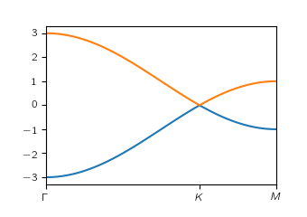

.. _pythtb_mainpage:

.. meta::
   :keywords: PythTB, PyTB, python, tight binding, Wannier, Berry,
              topological insulator, Chern, Haldane, Kane-Mele, Z2, graphene,
              band structure, wavefunction, bloch, periodic insulator,
              wannier90, wannier function, density functional theory,
              DFT, first-principles

=============================
Python Tight Binding (PythTB)
=============================

The "**Pyth**\ on **T**\ ight **B**\ inding" (``PythTB``) package is
designed to facilitate the construction and manipulation of tight-binding
models for the electronic structure of materials. It includes tools for
defining lattice structures, hopping parameters, and other model
ingredients, as well as for computing electronic properties such as
band structures and quantum geometry (Berry curvature, Berry phases,
hybrid Wannier functions, etc.). Additionally, it interfaces with
Wannier90 to allow for the construction of Wannierized tight-binding models.

The primary location for this package is at
`<http://www.physics.rutgers.edu/pythtb>`_ where the most up-to-date
releases and information can be found.

Motivations and capabilities
----------------------------

The ``PythTB`` package was written in Python for several reasons,
including

-  The ease of learning and using Python
-  The wide availability of Python in the community
-  The flexibility with which Python can be interfaced with graphics and
   visualization modules
-  In general, the easy extensibility of Python programs

You can get an idea of the capabilities of the package by
browsing the :doc:`PythTB examples <examples>`.

Tight-binding models
^^^^^^^^^^^^^^^^^^^^^

The `tight binding <http://en.wikipedia.org/wiki/Tight_binding>`_
method is an approximate approach for solving for the electronic wave
functions for electrons in solids assuming a basis of localized
atomic-like orbitals. We assume here that the orbitals are
orthonormal, and focus on the “empirical tight binding” approach in
which the Hamiltonian matrix elements are simply parametrized, as
opposed to being computed ab-initio.

The ``PythTB`` package is intended to set up and solve tight-binding
models for the electronic structure of

-  0D clusters
-  1D chains and ladders
-  2D layers (square lattice, hexagonal lattice, honeycomb lattice,
   etc.)
-  3D crystals
-  clusters, ribbons, slabs, etc., cut from higher-dimensional crystals
-  etc.

It provides tools for setting up more complicated
tight-binding models, e.g., by “cutting” a cluster, ribbon, or slab
out of a higher-dimensional crystal, and for visualizing the
connectivity of a tight-binding model once it has been
constructed.

As currently written, it is not intended to handle realistic chemical
interactions. So for example, the `Slater-Koster forms
<http://en.wikipedia.org/wiki/Tight_binding#Table_of_interatomic_matrix_elements>`_
for interactions between *s*, *p* and *d* orbitals are *not currently
coded*, although the addition of such features could be considered for
a future release.

Topology and quantum geometry
^^^^^^^^^^^^^^^^^^^^^^^^^^^^^^^

The ``PythTB`` package includes capabilities for

-  computing electron eigenvalues and eigenvectors at selected k-points
   or on a mesh of k-points
-  generating band-structure plots
-  generating density-of-states plots

It can also calculate `Berry phases, connections and curvatures
<http://en.wikipedia.org/wiki/Berry_connection_and_curvature>`_ in
ways that are useful for calculations of

-  adiabatic charge transport
-  electric polarization
-  anomalous Hall conductivity
-  topological indices
-  etc.

Wannier90 interface
^^^^^^^^^^^^^^^^^^^^^

Starting with Version 1.7, ``PythTB`` also provides an interface
to the `Wannier90 <http://wannier.org>`_ code, which can
be used to take the output of a first-principles density-functional
calculation and construct from it a tight-binding model, in
the basis of Wannier functions, that accurately reproduces the
first-principles bandstructure. See :doc:`usage <usage>`.

Get started with PythTB
-----------------------
PythTB is 
This is a simple example showing how to define graphene tight-binding
model with first neighbour hopping only. Below is the source code and
plot of the resulting band structure. Here you can find :doc:`more examples <examples>`.

.. raw:: html

    <table style="margin-left: 20px;" align="center" border="0"><tbody><tr>
    <td width="50%">

.. literalinclude:: simple_fig/simple_fig.py

.. raw:: html

    </td>
    <td width="50%">

.. raw:: html

    </td></tr>
    </tbody></table>

.. _history:

History
-------

This code package had its origins in a simpler package that was
developed for use in a special-topics course on “Berry Phases in Solid
State Physics” offered by D. Vanderbilt in Fall 2010 at Rutgers
University. The students were asked to use the code as provided, or to
make extensions on their own as needed, in order to compute properties
of simple systems, such as a 2D honeycomb model of graphene, in the
tight-binding (TB) approximation. Sinisa Coh, who was a PhD student
with Vanderbilt at the time, was the initial developer and primary maintainer
of the package. Since then, many others have contributed to its development,
including those listed in the :ref:`Acknowledgments <Acknowledgments>` section.

.. _Acknowledgments:

Acknowledgments
----------------
`PythTB` has benefited from the contributions of many individuals over the years. 
Below is a list of the current maintainers and contributors, along with their affiliations.
We apologize for any omissions, and welcome feedback and corrections. 

Maintainers
^^^^^^^^^^^^^^^^
- `Trey Cole <mailto: trey@treycole.me>`_ - Rutgers University
- `David Vanderbilt <mailto: dhv@physics.rutgers.edu>`_ - Rutgers University
- `Sinisa Coh <mailto: sinisacoh@gmail.com>`_ - University of California at Riverside (formerly Rutgers University)

Contributors
^^^^^^^^^^^^^^^^
We gratefully acknowledge additional contributions to PythTB from:

- Wenshuo Liu - formerly Rutgers University
- Victor Alexandrov - formerly Rutgers University
- Tahir Yusufaly - formerly Rutgers University
- Maryam Taherinejad - formerly Rutgers University

Funding
^^^^^^^^^^

This Web page is based in part upon work supported by the US National
Science Foundation under Grants DMR-1005838, DMR-1408838, DMR-1954856,
and DMR-2421895.  Any opinions, findings, and
conclusions or recommendations expressed in this material are those of
the author and do not necessarily reflect the views of the National
Science Foundation.

License
-------

Note that the ``PythTB`` code is freely distributed under the terms of
the :download:`GNU GPL public license <misc/LICENSE>`. You may
use it for your own research and educational purposes, or pass it on
to others for similar use. You may modify it, but if you do so
you must include a prominent notice stating that you have changed the
code and include a copy of this license.

Feedback
--------

Please send comments or suggestions for improvement to `these email
addresses <mailto: trey@treycole.me, dhv@physics.rutgers.edu, sinisacoh@gmail.com>`_.

.. toctree::
   :maxdepth: 1
   :hidden:

   Home <self>
   install
   usage
   examples
   CHANGELOG
   formalism
   resources
   citation