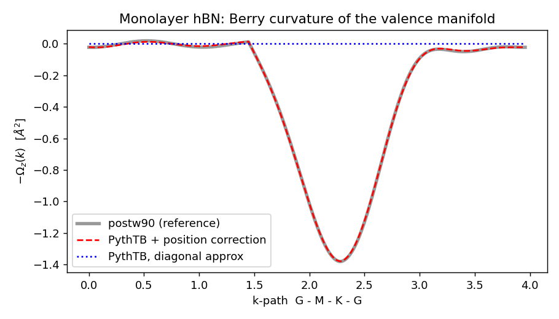
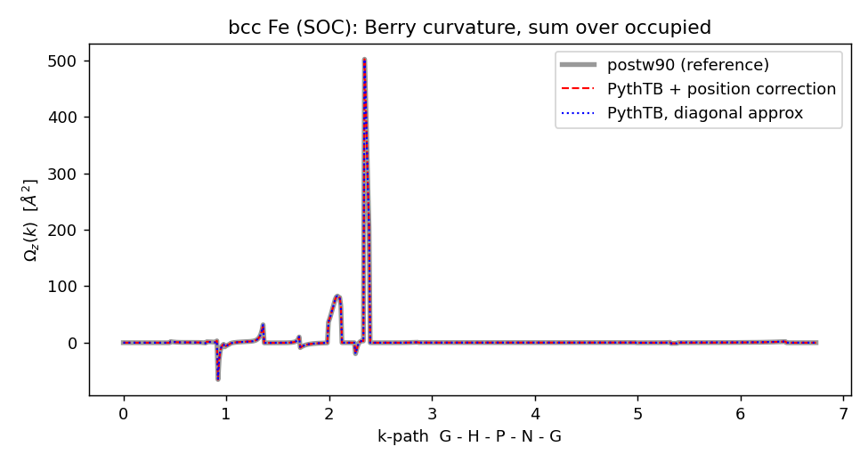

# Berry-curvature benchmarks: validating the `write_tb` position-matrix correction

These directories let you regenerate, from first principles, the data that
validates PythTB's off-diagonal position-matrix correction (read from
Wannier90's `write_tb` output) against Wannier90's own `postw90` Berry module.

* **`hBN/`** – monolayer hexagonal boron nitride. Fast (minutes), no SOC. The
  4-valence Wannier manifold is *complete*, so the diagonal-position
  approximation gives **exactly zero** Berry curvature and the entire signal is
  the correction. Validates the curl (J0) term.
* **`Fe/`** – bcc iron with spin-orbit coupling, the classic anomalous-Hall
  benchmark (σ_xy ≈ 750 S/cm). A metal, so the occupied set varies with **k**
  and the J1/J2 terms of the formula are active – this exercises the *full*
  correction.

## Result (hBN)

`hBN/verify.py` compares −Ω_z(**k**) along Γ–M–K–G:

```
max|postw90 Omega_z|    : 1.380536 Ang^2
max|uncorrected|        : 0.000e+00 Ang^2   (diagonal approx -> exactly 0)
peak relative error     : 5.9e-03
correlation             : 0.999960
best-fit scale          : 1.00164
RESULT: PASS
```



The PythTB+correction curve lies on top of postw90; the diagonal approximation
is flat at zero.

## Result (Fe, SOC)

`Fe/verify.py` along Γ–H–P–N–G and the anomalous Hall conductivity:

```
WITH correction : corr=1.00000  fit_scale=1.0002  peak_relerr=2.0e-04
WITHOUT (diag)  : corr=0.99999  (J2 only - misses J0,J1)
AHC sigma_xy (25^3): with corr =  1224.82 S/cm,  diagonal =  1224.04 S/cm
  (postw90 plain 25^3 reference: |sigma_xy| = 1224.82 S/cm)
RESULT: PASS
```



Fe is a metal, so the occupied set varies with **k** and the J1/J2 terms are
active — this validates the *full* formula (not just the J0 curl). The
correction reproduces postw90's AHC to the digit. Note the diagonal
approximation is also highly correlated *along the path* here, because Fe's
sharp curvature near band crossings is dominated by the velocity (J2) term; the
position correction is a smaller effect at this coarse 4×4×4 Wannier mesh.
The famous converged value (~750 S/cm) needs a denser `mp_grid` and adaptive
mesh refinement (`berry_curv_adpt_kmesh`).

## Toolchain note (IMPORTANT, macOS / Apple Silicon)

The `wannier90.x` / `postw90.x` on this machine (and QE 7.4.1's bundled copies)
**segfault in `ZDOTC`**. This is the well-known Apple Accelerate ↔ gfortran ABI
bug: Accelerate's legacy complex BLAS dot-products (`zdotc/zdotu/cdotc/cdotu`)
return their result via a hidden pointer argument, but gfortran (without
`-ff2c`) expects it returned in registers. `pw.x` is unaffected because it does
not call those routines.

`dotfix.c` re-implements the four functions with the register-return ABI;
`libdotfix.dylib` is injected ahead of Accelerate:

```sh
cc -O2 -dynamiclib -o libdotfix.dylib dotfix.c
export DYLD_INSERT_LIBRARIES=$PWD/libdotfix.dylib
export DYLD_FORCE_FLAT_NAMESPACE=1
```

The `run.sh` scripts set this automatically. The proper long-term fix is to
rebuild Wannier90 against OpenBLAS (available at `/opt/homebrew/opt/openblas`).

## Running

```sh
cd hBN && ./run.sh      # minutes
cd Fe   && ./run.sh     # longer (SOC, 18 Wannier functions)
```

Each `run.sh` runs `pw.x` (scf, nscf) → `wannier90 -pp` → `pw2wannier90` →
`wannier90` → `postw90`, then the Python `verify.py`.

## Matching postw90 exactly: two conventions

`postw90`'s `get_AA_R` reconstructs the Berry connection from the `.mmn`
overlaps with a couple of conventions that the verification matches:

1. **`use_ws_distance = false`** – use the plain `Σ_R e^{ik·R}` interpolation
   (no minimal-image translations), matching the PythTB reader.
2. **`transl_inv = true`** – use the log-form (Marzari–Vanderbilt Eq. 31)
   diagonal of the position matrix, which is what `write_tb` already stores.

In addition the connection is **Hermitianized** (`½(A + A†)`) and the index
order is transposed relative to `_tb.dat`; `berry_curvature_wannier`
(in `pythtb/io/w90.py`) applies `A_R = ½(pos_R + conj(pos_{-R}^T))`.

`postw90` prints `−Ω`; the PythTB routines return `+Ω`.

## What's used from PythTB

```python
from pythtb import W90
w90 = W90("hBN", "hBN")          # reads hBN_tb.dat (needs write_tb=.true.)
w90.has_position_matrix          # True
w90.position_matrix()            # {R: (3, num_wan, num_wan)}  <0n|r|Rm>  (Ang)
w90.wannier_centers()            # <0n|r|0n>, matches _centres.xyz
A = w90.berry_connection_wann(k) # Wannier-gauge Berry connection A^W(k)

tb = w90.model()                 # the correction is integrated into TBModel
tb.has_wannier_position          # True

# berry_curvature auto-includes the external position matrix for write_tb
# models. plane=(0,1) -> Omega_z; metals: pass fermi=...
Om  = tb.berry_curvature(k, occ_idxs=[0,1,2,3], plane=(0,1), cartesian=True)
Om0 = tb.berry_curvature(k, occ_idxs=[0,1,2,3], plane=(0,1), cartesian=True,
                         include_external=False)   # diagonal (Kubo) approximation
```

`TBModel.berry_curvature(..., include_external=None, fermi=None)`:
`include_external=None` (default) includes the external off-diagonal position
matrix when the model carries one; `True` requires it; `False` forces the
diagonal Kubo result. The correction is the band-summed quantity, so
`non_abelian=True` and parameter sweeps are not supported with it.

## Files

| file | description |
|------|-------------|
| `dotfix.c`, `libdotfix.dylib` | Accelerate ZDOTC ABI shim |
| `berry_wannier.py` | standalone reference implementation (used by verify.py) |
| `*/gen_*.py` | generate the QE + Wannier90 input files |
| `*/run.sh` | full pipeline driver |
| `*/verify.py` | compare PythTB (with/without correction) vs postw90 |
| `hBN/make_effective.py` | convert `_tb.dat` to postw90 effective-model inputs |
